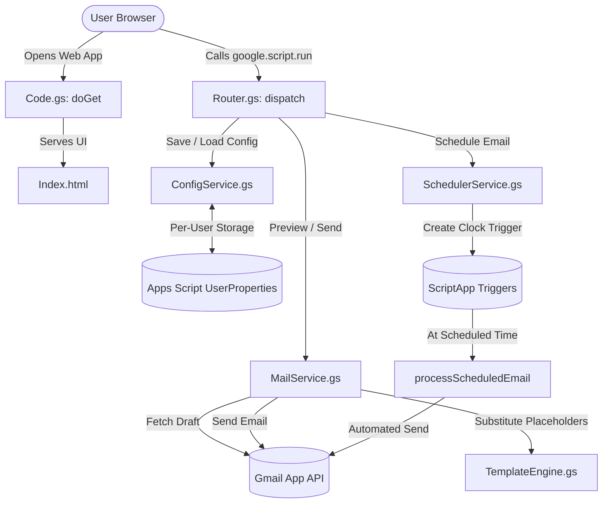

# Daily Status Report Automation

[](https://developers.google.com/apps-script)
[](https://developer.mozilla.org/en-US/docs/Web/JavaScript)
[](LICENSE)

An automated web application built on **Google Apps Script** to streamline, format, preview, and schedule daily status report emails sent via Gmail. 

Say goodbye to manually opening Gmail, editing drafts, fixing dates, and re-pasting bullet points every day. Fill out your activities, preview the rendered email with your exact Gmail signature and formatting, and send it immediately or schedule it for automated delivery.

---

## ✨ Features

- ⚙️ **One-Time Setup**: Pick a Gmail draft template and enter default `TO` and `CC` recipients once. Configuration is saved securely per-user in Apps Script `UserProperties`.
- 🎨 **Format & Signature Preservation**: Uses your existing Gmail draft as a template. Preserves all original HTML formatting, tables, custom fonts, brand colors, images, and Gmail signatures.
- 👁️ **Live Editable Preview**: Inspect the fully rendered report in an interactive modal. Edit subject lines or body text directly in the browser iframe before sending.
- ⏰ **Email Scheduling**: Set a date and time for automated delivery using native Google Apps Script time-driven triggers (`ScriptApp.newTrigger`).
- 📅 **Smart Date Resolution**: Automatically fills today's date (`DD-MM-YYYY`) and auto-rolls "tomorrow's date" forward over weekends to Monday (both remain fully editable).
- 📱 **Clean Responsive UI**: Modern glassmorphism-inspired UI with CSS variable design tokens and mobile responsiveness.

---

## 🛠️ Tech Stack

- **Backend**: Google Apps Script (V8 Runtime)
- **Frontend**: HTML5, CSS3 (Vanilla), JavaScript (Vanilla ES6)
- **Mail Service**: Native Google `GmailApp` API
- **Storage**: `PropertiesService.getUserProperties()` (No external databases required)
- **Scheduler**: Native `ScriptApp` Time-Driven Clock Triggers
- **CLI / Deployment**: Google `clasp` (`@google/clasp`)

---

## 📋 How It Works



---

## 📝 Gmail Draft Template Setup

To use this app, create a single draft in your Gmail account containing any or all of the following placeholders:

| Placeholder | Description | Example Output |
|---|---|---|
| `{{TODAY_DATE}}` | Today's date (`DD-MM-YYYY`) | `18-08-2026` |
| `{{TOMORROW_DATE}}` | Tomorrow's date (rolls weekends to Monday) | `19-08-2026` |
| `{{TASK_LIST}}` | Multi-line activities converted to a numbered list | `1) Monitor Email<br><br>2) Configured VLAN` |
| `{{PLANNED_TASK}}` | Planned steps for tomorrow | `Continue pending activities.` |

> **Tip**: You can use `{{TODAY_DATE}}` in the subject line of your Gmail draft as well (e.g. `Daily Status Report - {{TODAY_DATE}}`).

---

## 📂 Project Directory Structure

```text
daily-status-report/
├── backend/
│   ├── appsscript.json            # Apps Script manifest configuration
│   ├── .clasp.json                # clasp project binding (Script ID)
│   └── src/
│       ├── bootstrap/
│       │   └── Code.gs            # Web App entry point (doGet & includes)
│       ├── controllers/
│       │   ├── ConfigHandler.gs   # Configuration endpoints
│       │   ├── MailHandler.gs     # Mail send/draft endpoints
│       │   ├── PreviewController.gs# Email preview endpoints
│       │   ├── ScheduleHandler.gs # Email scheduling endpoints
│       │   └── SystemController.gs  # Health check endpoint
│       ├── models/
│       │   └── Constants.gs       # Action names, property keys, placeholders
│       ├── repositories/
│       │   └── PropertiesRepository.gs # UserProperties data wrapper
│       ├── router/
│       │   └── Router.gs          # Central action dispatcher
│       ├── services/
│       │   ├── ConfigService.gs   # Config business logic
│       │   ├── MailService.gs     # Draft loading & Gmail delivery
│       │   ├── PreviewService.gs  # Template rendering service
│       │   ├── SchedulerService.gs# Time-driven trigger management
│       │   ├── SystemService.gs   # System health service
│       │   └── TemplateEngine.gs  # Placeholder replacement engine
│       ├── utils/
│       │   ├── DateUtils.gs       # Date formatting utilities
│       │   ├── ResponseUtils.gs   # Standard JSON response builders
│       │   ├── Utils.gs           # String & HTML sanitizer helpers
│       │   └── ValidationUtils.gs # Input validation helpers
│       └── views/
│           ├── Index.html         # Main HTML layout
│           ├── JavaScript.html    # Client-side UI logic & backend bridge
│           └── Stylesheet.html    # CSS styles & design system
├── docs/
│   ├── api.md                     # Detailed backend API contract
│   ├── architecture.md            # Architecture overview
│   ├── deployment.md              # Step-by-step deployment guide
│   └── product.md                 # Product specification & scope
├── scripts/
│   ├── deploy.ps1                 # Windows deployment helper script
│   └── deploy.sh                  # macOS/Linux deployment helper script
├── .gitignore                     # Git ignore rules
├── LICENSE                        # MIT License
└── README.md                      # Project documentation
```

---

## 🚀 Deployment Guide

### Prerequisites

1. **Node.js** (v14+) installed on your machine.
2. **Google Account** with access to Gmail and Google Apps Script.
3. Enable the **Google Apps Script API**:
   - Go to [https://script.google.com/home/usersettings](https://script.google.com/home/usersettings)
   - Toggle **Google Apps Script API** to **ON**.

### Step 1: Clone the Repository

```bash
git clone https://github.com/GARJE-01/Daily-status-report-.git
cd Daily-status-report-
```

### Step 2: Authenticate `clasp`

Log in to your Google account via terminal:

```bash
npx -y @google/clasp login
```

### Step 3: Create & Bind Apps Script Project

Navigate to the `backend` folder and create a new project:

```bash
cd backend
npx -y @google/clasp create --title "Daily Status Report" --type standalone
```

### Step 4: Push Files to Google Apps Script

Push all code files from local to Google Apps Script:

```bash
npx -y @google/clasp push
```

*Or use the helper script from project root*:
- **Windows (PowerShell)**: `powershell -ExecutionPolicy Bypass -File scripts/deploy.ps1`
- **macOS / Linux (Bash)**: `./scripts/deploy.sh`

### Step 5: Deploy Web App

1. Open your Apps Script project editor:
   ```bash
   npx -y @google/clasp open
   ```
2. In the top right, click **Deploy** $\rightarrow$ **New deployment**.
3. Click the Gear icon ⚙️ next to *Select type* $\rightarrow$ choose **Web app**.
4. Configure deployment settings:
   - **Execute as**: `User accessing the web app` *(Important: Ensures each user uses their own Gmail drafts and properties)*
   - **Who has access**: `Anyone with Google account` (or `Anyone`)
5. Click **Deploy**, authorize requested permissions, and copy the **Web App URL**.

---

## 📖 API Reference

All frontend requests pass through `google.script.run.runAction(action, payload)`.

| Action | Payload | Description |
|---|---|---|
| `getDrafts` | None | Returns list of Gmail drafts in caller's account |
| `getConfig` | None | Loads saved `draftId`, `to`, `cc` from `UserProperties` |
| `saveConfig` | `{ draftId, to, cc }` | Persists user draft selection and email recipients |
| `previewEmail` | `{ taskList, plannedTask, todayDate, tomorrowDate }` | Renders report from Gmail draft and returns subject & HTML body |
| `sendEmail` | `{ taskList, plannedTask }` or `{ subject, body }` | Sends email via `GmailApp.sendEmail` immediately |
| `scheduleEmail` | Report payload + `{ scheduledAt }` | Sets up a time-driven trigger (`ScriptApp.newTrigger`) for target timestamp |
| `getScheduledEmail` | None | Returns details of active pending scheduled email |
| `cancelScheduledEmail` | None | Deletes active trigger and clears stored schedule |

---

## 📜 License

This project is licensed under the [MIT License](LICENSE).

---

## 👨‍💻 Author

Developed by **[GARJE-01](https://github.com/GARJE-01)**.  
Repository: [https://github.com/GARJE-01/Daily-status-report-.git](https://github.com/GARJE-01/Daily-status-report.git)
